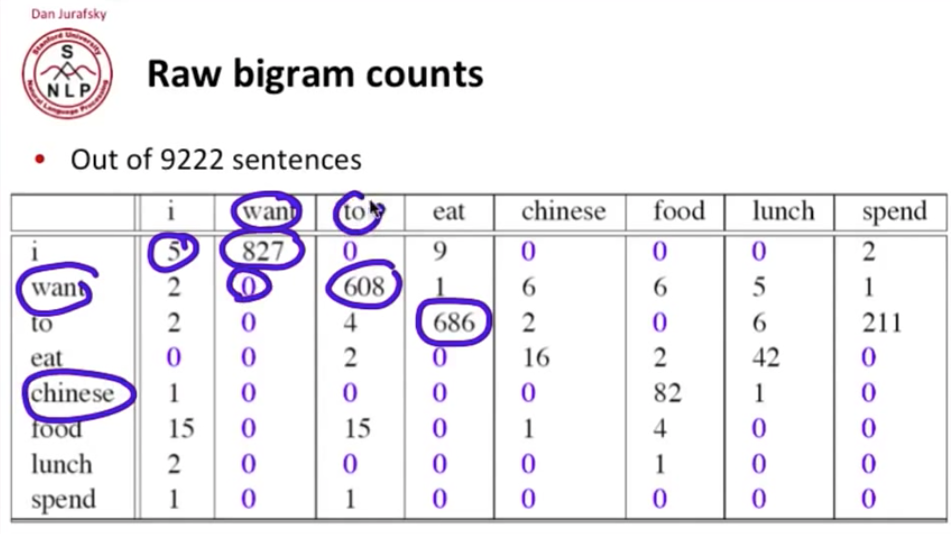
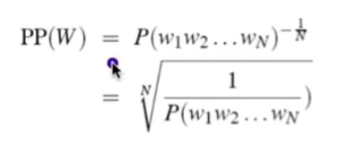
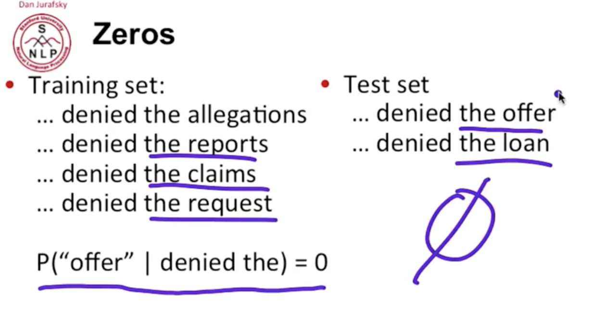
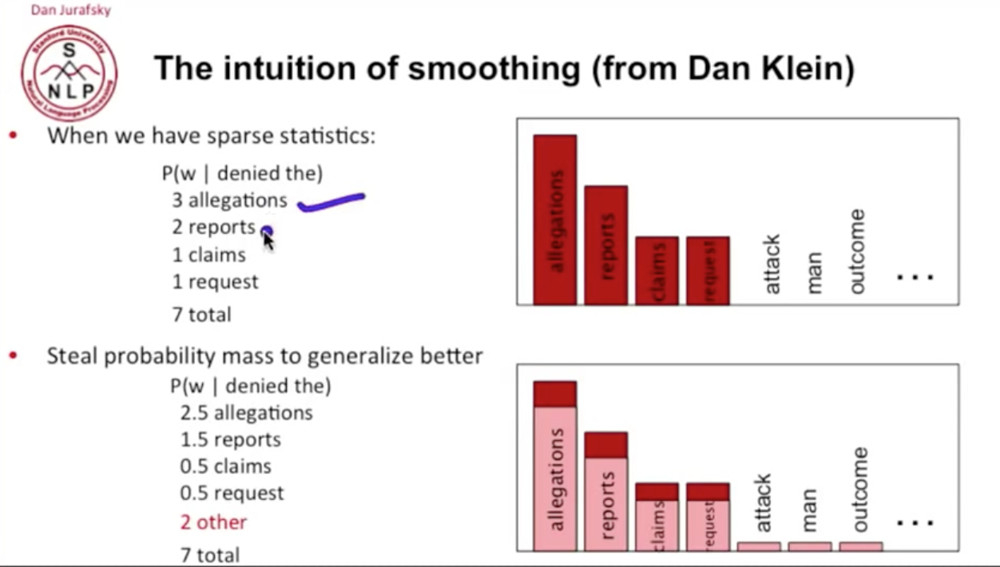
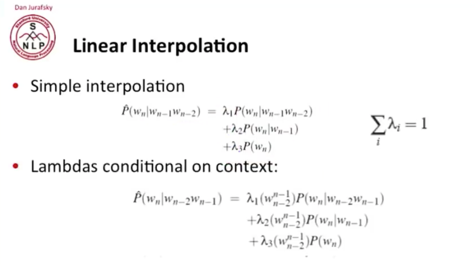
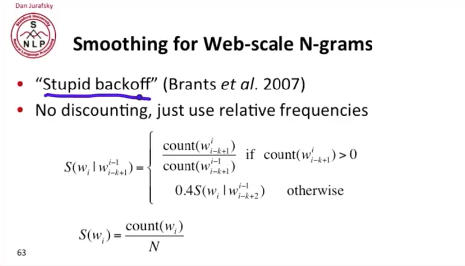

# Stanford-NLP-Notes
Notes following along with Professor Dan Jurafsky &amp; Chris Manning's online NLP course

## 1-1 Course Introduction

### Applications of NLP
- Question Answering (Jeopardy)
- Information Extraction (Create calendar appointment from email)
- Sentiment Analysis (Product review aggregation)
- Machine Translation ([Phrasal Project](https://github.com/stanfordnlp/phrasal))

### Problems in Language Tech
Mostly solved: email spam detection, Part-of-Speech (POS) tagging, Named Entity Recognition (NER)
Good progress: all the Applications in first section, "word sense" disambiguation (e.g. Computer mouse), Parsing
Hard: Question Answering, Paraphrasing, Summarization, Dialogue with human

### Ambiguity Makes NLP Hard

```"Violinist Linked to JAL Crash Blossoms" ```

Correct interpretation: Violinist who was involved in the JAL crash is now "blossoming," getting really popular.
Incorrect interpretation a parser could make: A violinist is linked to "JAL Crash Blossoms." [Wtf is a Crash Blossom](http://www.testycopyeditors.org/phpBB3/viewtopic.php?f=8&t=11134)?

```
"Teacher strikes idle kids"
"Red tape holds up new bridges"
```

Parser may think that red tape is physically supporting the new bridges

### Ambiguity is Pervasive

```"Fed raises interest rates"```

"Fed raises     interest     rates" (The Fed raises are getting interest from the rates)

And what about...

"Fed raises interest rates 0.5%"

### Other Difficulties with NLP
- Slang ("non-standard English")
- Segmentation (New York-New Haven Railroad)
- Idioms
- Entity Names

## 2-1 Regular Expressions
"Formal language for specifying text strings"

- Disjunctions [ ] Letters inside square brackets. ```[wW]oodchuck```
- Ranges ```[A-Za-z]```
- Negations in disjunctions ```[^A-Z] "not an uppercase letter"```
- Pipe | or. ```a | b | c == [abc]```
- ? the previous character is optional ```[colou?r]```
- * 0 or more of the previous character ```00*1```
- + 1 or more of the previous character ```0+1```
- . any character
- ^[A-Z] Anchor to beginning of line "match capital letters at the beginning of lines"
- $[A-Z] Achor to end of line "match cpas at the end of lines"

### Create RegEx for all instances of "the"
```
[Tt]he                      // still finds "oTHEr"
[Tt]he^[A-Za-z]             // still finds "bliTHE"
^[A-Za-z][Tt]he^[A-Za-z]    // yay
```

### Type I and Type II Errors
**Type I**: False positive: matching things we should not have matched
**Type II**: False negative: not matching things we should have matched

NLP constantly deals with these errors through 2 antagonistic efforts:
1. Increase *accuracy* or *precision* by minimizing Type I errors
2. Increase *coverage* or *recall* by minimizing Type II errors.

## 2-2 RegEx in Practical NLP
Lexers == Tokenizers.
Stanford English Tokenizer.

## 2-3 Word Tokenization
How many words are in a text? Depends on how you define words. And when dealing with natural language:

```
"Yeah uh I work month-monthly rotations here."
```

How do we deal with uh, a "filled pause"?
How do we deal with month-, the "fragment" before the actual intended word?

**Lemma**: same stem, POS, roughly the same word sense ```cat == cats"```
**Wordform**: full inflected surface form ```cat !== cats```

**Type**: an element of the vocabulary
**Token**: an instance of that type in the running text

**N** usually defines the number of tokens. **V** represents the vocabulary. **\| V \|** is the size of the vocabulary.

Use the [tr unix command](https://en.wikipedia.org/wiki/Tr_\(Unix\)) along with sort and unique to split a text into a word-per-line doc, count all words, sort by frequency

```
tr 'A-Z' 'a-z' < input.txt | tr -sc 'A-Za-z' '\n' | sort | uniq -c | sort -n -r > output.txt
```

### Issues in Tokenization
- Finland's
- What're, I'm, isn't
- Hewlett-Packard
- State-of-the-art
- San Francisco
- m.p.h. PhD
- Language issues
  - French: L'ensemble
  - German: noun compounds are not segmented. "Life insurance company employee" == "Lebensversicherungsgesellschaft Mitarbeiter"
  - Chinese/Japanese: no spaces between words
  - Japanese: multiple alphabets intermingled

### Maximum Matching Word Segmentation
```
thecatinthehat === the cat in the hat
thetabledownthere === theta bled own there
```
The algorithm above works well for Chinese, where words are composed of characters, and the average word length is ~2.4 characters. Characters are generally 1 syllable and 1 morpheme.

## 2-4 Word Normalization and Stemming

### Normalization
- Normalizing terms means different things for different applications. In information retrieval, we want the indexed text & query terms to have the same form. E.g. we want to match U.S.A. and USA.
- Implicitly define equivalence classes of terms, e.g. deleting the periods in a term. Alternatively, we could use *asymmetric expansion*, generating other search terms based on the one passed in.
  - User enters: **window** so we search for: **window, windows**
  - User enters: **windows** so we search for: **Windows, windows, window**
  - User enters: **Windows** so we search for: **Windows**
- Asymmetric expansion is potentially more powerful than equivlence class approach, but less efficient.
- In applications like IR: reduce all letters to lowercase, since users tend to use lower case. A possible exception: encountering upper case in mid-sentence, e.g. **sail**, **sail** vs **sail**, **sail** vs. **sail**.
- For sentiment analysis, MT, Information Extraction, case IS helpful (**US** versus **us** is important)

### Lemmatization
- Reduce inflections or variant forms to base form
  - am, are, is --> be
  - car, cars, car's, cars' --> car
  - *the boy's cars are different colors --> the boy car be different color*
- **Lemmatization**: have to find correct dictionary headword form
- Machine Translation
  - Spanish **quiero** ('I want'), **quieres** ('you want') is the same lemma as **querer** ('want')

### Morphemes
- The small meaningful units that make up words
- **Stems**: the core meaning-bearing units
- **Affixes**: bits and pieces that adhere to stems
  - Often with grammatical functions

### Stemming
- Reduce terms to their steams in information retrieval
- *Stemming* is crude chopping of affixes
  - language dependent
  - e.g. **automate(s)**, **automatic**, **automation** all reduced to **automat**.

### Porter's Algorithm
The most common English stemmer. A series of search and replace rules to reduce words down to their stems.

- Step 1A
  - sses -> ss
  - ies -> i
  - ss -> ss
  - s -> ø
- Step 1B
  - (\*v\*)ing -> ø
  - (\*v\*)ed -> ø
- Step 2 (for long stems)
  - ational -> ate
  - izer -> ize
  - ator -> ate
- ... even more complicated rules for very long stems

### Using Unix tools to look at morphology in a corpus

Code below does the usual stuff, and then we ```grep``` for all words ending in "ing".
```
tr -sc 'A-Za-z' '\n' < mlkdream.txt| tr 'A-Z' 'a-z' | grep 'ing$' | sort | uniq -c | sort -n -r > test.txt
```

```
  12 ring
   3 sweltering
   3 sing
   2 suffering
   2 meaning
   2 knowing
   1 withering
   1 tranquilizing
   1 stating
   1 something
   1 signing
   1 nothing
   1 meeting
   1 lodging
   1 languishing
   1 jangling
   1 invigorating
   1 honoring
   1 heightening
   1 having
   1 gaining
   1 dripping
   1 drinking
   1 cooling
   1 beginning
   1 awakening
   1 asking
```
Nice, but there are some words here where we don't want to apply our stemming rule. Ring would just be r. Sing would just be s.

Let's modify the grep rule to find all words ending in "ing" but that have a vowel beforehand, "has an earlier vowel".

```
tr -sc 'A-Za-z' '\n' < mlkdream.txt | tr 'A-Z' 'a-z' | grep '[aeiou].*ing$' | sort | uniq -c | sort -n -r > test2.txt
```

```
   3 sweltering
   2 suffering
   2 meaning
   2 knowing
   1 withering
   1 tranquilizing
   1 stating
   1 something
   1 signing
   1 nothing
   1 meeting
   1 lodging
   1 languishing
   1 jangling
   1 invigorating
   1 honoring
   1 heightening
   1 having
   1 gaining
   1 dripping
   1 drinking
   1 cooling
   1 beginning
   1 awakening
   1 asking
```

Nothing is still an issue here, but this addition improved our rule overall.

## 2-5 Sentence Segmentation
How do we split up a sentence in a meaningful way?

? and ! are relatively unambiguous.

Periods, "." is quite ambiguous.
  - Sentence boundary
  - Abbreviations like Inc. or Dr.
  - Numbers like .02% or 4.69

How do we tackle the period problem? Build a **binary classifier** that decides whether a period is an End-of-Sentence (EOS) mark or not.

How would we do this? Handwritten rules, RegEx, machine-learning classifiers.

Simplest classifier: **Decision Tree**. A simple if-then procedure that branches based on answer.

Determining if a word is EOS. We can consider the case of the word with the ".": Upper, Lower, Cap, Number. And consider the word after ".": Upper, Lower, Cap, Number. And then some numeric features:
- Length of word with "."
- Probability (word with "." occurs at EOS)
- Probability (word after "." occurs at BOS)

Is this the kind of word that tends to end an sentence? Is the word after the period one that tends to begin a sentence?

#### Implementing Decision Trees
- A decision tree is just an If-then-else statement
- The interesting research is choosing the features
- Setting up the structure is often too hard to do by hand

## 3-1 Defining Minimum Edit Distance
"How similar are two strings?"

That is the question we look to answer with Minimum Edit Distance.

**Minimum Edit Distance**: the minimum number of edits -- insertions, deletions, or substitutions -- needed to transform one string into the other.

Basic implementation: all edit operations have cost 1.
Levenshtein implementation: substitution edits have cost 2, others remain cost 1.

Potential Applications:
- Computation biology: aligning genome sequences
- Machine translation: how good does our machine-translated sentence compare to a human expert's translation?
- Named Entity Extraction and Entity Coreferncing: "Stanford President" and "Stanford University President" are the same thing

We are searching for a path -- a sequence of edits -- that gets us from the initial string to the final string.

1. Initial state: the word to be transformed
2. Operations: insert, delete, substitute
3. Goal state: the word we want to transform to
4. Path cost: we want to minimize the # of edits

Definition: String **X** with length **n**. String **Y** with length **m**. We define a matrix **D** with size **n X m**.
- **D(i,j)**: edit distance between X\[1 ... i\] and Y\[1...j\] --> "the edit distance between the first **i** characters of string **X** and the first **j** characters of string **Y**."
- **D(n,m)**: the edit distance between **X** and **Y**.

## 3-2 Computing Minimum Edit Distance
How do we compute the minimum edit distance? *Dynamic Programming!*

```
// initalization
D(i,0) = i
D(0,j) = j

// recurrance relation
for each i = 1 ... M
  for each j = 1 ... N
    D(i,j) = minimum of
              D(i-1,j) + 1 (deletion)
              D(i,j-1) + 1 (insertion)
              D(i-1,j-1) +          2 if x(i) ≠ j(i)
                                    0 if x(i) = j(i)

// termination
D(N,M) is a distance
```

## 3-3 Backtrace for Computing Alignments
Backtracing is a way to keep track of *how* we reached out minimum edit distance: which operations did we take to reach this final state?

To keep track, add an additional step to our DP algorithm to keep track which cell we came from to compute our current cell.

```
// initalization
D(i,0) = i
D(0,j) = j

// recurrance relation
for each i = 1 ... M
  for each j = 1 ... N
    D(i,j) = minimum of
              D(i-1,j) + 1 (deletion)
              D(i,j-1) + 1 (insertion)
              D(i-1,j-1) +          2 if x(i) ≠ j(i)
                                    0 if x(i) = j(i)

// backtrace step
ptr(i,j) = LEFT if insertion
           DOWN if deletion
           DIAG if substitution

// termination
D(N,M) is a distance
```

"An optimal alignment is composed of optimal subalignments."

Performance:
```
time: O(nm)
space: O(nm)
backtrace: O(n+m)
```

## 3-4 Weighted Minimum Edit Distance
Why would we want to weight the edit distance?

- Spell correction: some letters are more commonly mistaken for others, e.g. e's are often incorrectly typed as a's.
- Layout of the keyboard: physical layout means some errors are more common than others
- Biology: some insertions/deletions are more likely than others for sciency reasons

Edit the DP algorithm above to use operation-specific lookup tables instead of just +1 or +2 constant costs.

## 3-5 Minimum Edit Distance in Computational Biology
Sequence alignment of proteins, nucelotides, DNA sequences. Why?
- to find important regions
- determine function
- uncover evolutionary forces
- Assemble fragments to sequence DNA

In NLP, we generally talk about **distance** (minimized)
in Computational Biology, we generally talk about **similarity** (maximized)

The **Needleman-Wunsch Algorithm** is a variant of the DP minimum edit distance algo above, specific for computational biology.

Some variants of the basic algorithm:
- Maybe it's OK to have an unlimited number of gaps in the beginning and end -- change the initalization values to 0 for everything.

#### The Local Alignment Problem
Given two strings:

```
x = x_1 ... x_m
y = y_1 ... y_n
```

Find substrings **x'** and **y'** whose similarity (optimal global alignment value) is maximum.

Example:

```
x = aaaacccccggggtta
y = ttcccgggaaccaacc
```
aaaacc**cccggg**gtta
tt**cccggg**aaccaacc

This problem allows us to ignore non-alignments anywhere, not just beginning and end.

## 4-1 Introduction to N-grams
**Goal**: assign a probability to a sentence.

Applications:
- Machine translation: "high winds" > "large winds"
- Spellcheck: "fifteen minutes away" > "15 minuets aways"
- Speech recognition: "I saw a van" > "Eyes awe of an"

P(W) = P(w<sub>1</sub>,w<sub>2</sub>,w<sub>3</sub>,w<sub>4</sub>,...,w<sub>n</sub>)

It's also handy to compute the probability of an upcoming word, based on words already seen:

P(w<sub>5</sub>|w<sub>1</sub>,w<sub>2</sub>,w<sub>3</sub>,w<sub>4</sub>)

A model that computes either P(W) or conditional probability of an upcoming word is called a **Language Model**, or **LM** for short.

### Conditional Probability Review
P(A|B) = P(A,B) / P(B)
P(A|B)*P(B) = P(A,B)
**P(A,B) = P(A|B)*P(B)**

If we add more variables...
**P(A,B,C,D) = P(A)*P(A|B)*P(C|A,B)*P(D|A,B,C)**

This generalizes to the [Chain rule](https://en.wikipedia.org/wiki/Chain_rule_(probability))

Applying the chain rule to compute the joint probability of words in a sentence:

P(w<sub>1</sub>,w<sub>2</sub>,w<sub>3</sub>,w<sub>4</sub>...w<sub>n</sub>) = π<sub></sub>i P(w<sub>i</sub>|w<sub>1</sub>,w<sub>2</sub>,...w<sub>i-1</sub>)

Example:

```P(the | its water is so transparent that) = count(its water is so transparent that the) / count(its water is so transparent that)```

**This won't work!** There are too many possible sentences in the world to ever get full counts

### Markov Assumption
A simplifying assumption: look at only one or a few previous words to compute each upcoming component, not the entire sentence.

P(w<sub>1</sub>,w<sub>2</sub>,w<sub>3</sub>,w<sub>4</sub>...w<sub>n</sub>) = π<sub></sub>i P(w<sub>i</sub>|w<sub>i-k</sub>,...,w<sub>i-1</sub>)

With k representing some prefix of a last few words.

The simpliest case is the **Unigram model**: Probability of a sentence is just a chain rule of the probabilities of the individual words themselves. I.e. how many times does this word occur in comparison to all words. No lookback.

**Bigram model**: consider only one word before the upcoming
**Trigram model**: consider only two word before the upcoming
...
**N-gram model**: consider only n words before the upcoming

Even then... this can be an insufficient model of language. Why? Language has **long distance dependencies.** Example:

```
"The computer which I had just put into that machine room on the fifth floor crashed."
```

The word "floor" is not going to be a really strong predictor of "crashed." But, the subject of the sentence, "computer", is an excellent predictor. But very far away.

Summary: Language Models seek to assign probabilities to sentences. N-gram models provide us a good initial approach for calculating these probabilities.

## 4-2 Estimating N-gram Probabilities

Esimating bigram probabilities is straightforward.

P(wi | wi-1) = c(wi-1, wi) / c(wi-1)

"Of all the times word i-1 occurred, how many times was it followed by word i?

This is the **maximum likelihood estimator.**



### Practical issues
- We do everything in log space.
  - Avoid underflow: multiplying a bunch of very small numbers (like in the chain rule) will produce an even smaller number, risk of underflow/loss of accuracy.
  - Also adding is faster computationally than multiplying

p<sub>1</sub> * p<sub>2</sub> * p<sub>3</sub> * p<sub>4</sub> = log(p<sub>1</sub>) * log(p<sub>2</sub>) * log(p<sub>3</sub>) * log(p<sub>4</sub>)

### Language Modeling Toolkin

[SRILM](http://www.speech.sri.com/projects/srilm/)
[Google N-Gram Release](https://books.google.com/ngrams)

## 4-3 Evaluation and Perplexity
Evaluation is important -- it allows us to compare the performance of different LMs. Does my LM prefer good sentences to bad ones? "Real" or "frequently observed" sentences should get higher probabilities than bad ones.

**Training data** is used to tune LM parameters. An **unseen test set** is used to evaluate it.

- Extrinsic evaluation (in-vivo): Comparing two LMs, A and B, by putting each model in a task (spellcheck, speech recognition, MT). Run the tests, determine model accuracy, compare. We're using something *external* to the n-gram model itself as a way to evaluate. Cons: time-consuming to perform evaluations.
- Intrinsic evaluation (perplexity): the probability of the test set, normalized by the number of words.
  - Perplexity is usually a bad appx. of external eval. So generally only useful for pilot experiments.

### The Shannon Game
How well can we predict the next word in a sentence? Unigrams are terrible at this game... why would that be?

- I always order pizza with cheese and ______
- The 33rd president of the US was ______
- I saw a ______

### Defining Perplexity

PP(W) = P(w<sub>1</sub>,w<sub>2</sub>,w<sub>3</sub>,w<sub>4</sub>...w<sub>n</sub>)<sup>-1/N</sup>



The longer the sentence, the less probable it's going to be, so this allows us to normalize and compare test sets of different lengths.

**Minimizing perplexity is the same as maximizing probability.**

### The Shannon Game intuition for perplexity

Another way to get an intuition for perplexity: it is the **weighted equivalent branching factor.** "On average, how many things could happen next?"

How hard is the task of recoginizing digits 0-9? **Perplexity = 10**

## 4-4 Generalization and Zeroes
A lot of language models are counts for bigrams and trigrams. We saw alot of those counts include 0 counts, ie phrases never seen. What do we do with those?

### The Shannon Visualization Method
A method for visualizing a LM model.

- Choose a random bigram
  - (<s>, w) according to its probability
- Now choose random bigram (w,x) according to its probability
- ...And so on until we choose </s>
- Then string the words together

```
<s> I
    I want
      want to
           to eat
              eat Chinese
                  Chinese food
                          food </s>
    I want to eat Chinese food
```

Consider Shakespeare as a corpus.

N = 884,647 tokens
V = 29,066 unique words
300,000 unique word pairing, ie "bigram types"

Out of V<sup>2</sup> = 844 million possible bigrams. I.e. **99.96%** of the possible bigrams were never seen (have zero entries in the table).

You can imagine that quadrigrams are much worse: What's coming out looks like Shakespeare because it **is** Shakespeare.

### The Perils of Overfitting
N-grams only work well for word prediction if the test set matches the training set. "If you train on Shakespeare and test on the WSJ, you're going to do a bad job predicting."



We are going to need a way to deal with zero probabilities in our n-grams.

## 4-5 Smoothing: Add One (Laplace) smoothing

Basic intuition of smoothing: "steal" some probability mass and use it for things we haven't seen, to generalize our models better.



Add-one (Laplace) smoothing is the most basic approach to this: "pretend we saw each word one more time than we actually did."

P<sub>MLE</sub> (w<sub>i</sub> | w<sub>i-1</sub>) = c(w<sub>i-1</sub>, w<sub>i</sub>) / c(w<sub>i-1</sub>)

The MLE probability is simply the count of all the times the combo wi-1 wi happened, divided by total count of wi-1.

P<sub>Add-1</sub> (w<sub>i</sub> | w<sub>i-1</sub>) = c(w<sub>i-1</sub>, w<sub>i</sub>) + 1 / c(w<sub>i-1</sub>) + V

We add V to the denominator because for each and every word that follows wi-1, we are adding one, and there are V total words that could follow.

MLE refresher: the Maximum Likelihood Estimate of some parameter of a model M from a training set T maximizes the likelihood of T given M.

Suppose: we see "bagel" 400 times in a corpus of 1,000,000 words. What is the P("bagel") in some other text?

```
MLE Estimate: 400/1000000 = .0004
```

This could be a bad estimate for some other corpus, but it is the estimate that makes it **most likely**
that "bagel" will occur 400 times out of a 1m word corpus.

Therefore, any smoothing estimate is a **non-MLE** because we are changing the counts from what they occurred in our training data in hopes of generalizing better.

We can take those probabilities and reconstitute the counts as if we had seen things the number of times necessary to get those add-1 probabilities naturally. What do those new counts look like, how have they changed our probabilities?


Note: these add one smoothing estimates can cause massive changes to our raw bigram counts. It makes very big changes in the counts in order to "steal" the right amount of mass to use across all those zeros.

Add-1 can be used in text classification and places where the number of zeros isn't so massive.

## 4-6 Interpolation
Sometimes it is helpful to use less context as opposed to more. We can condition on less context for contexts you haven't learned much about.

**Backoff**: use trigram if you have good evidence, otherwise bigram, otherwise unigram.
**Interpolation**: mix unigram, bigram and trigram.

Interpolation tends to work better than backoff.



How do we set the lambdas? Use a **held-out** corpus.

```
|             Training Data                 |    Held-Out Data    |     Test Data     |
```

Choose lambdas to maximize the probability of the held-out data.
- Fix the n-gram probabilities on the training set
- Then search for lambdas that give the largest probability to held-out set.

### Unknown Words: Open versus Closed vocabulary tasks
- If we know all the words in advanced
  - Vocabulary V is fixed
  - **Closed vocabulary task**
- Often we don't know this
  - Out of Vocabulary = OOV words
  - **Open vocabulary task**

How to deal with unknown words? <UNK> token.
- Create a fixed lexicon L of size V
- At text normalization phase, any training word not in L changed to <UNK>
- Now we train its probabilities like a normal word

At decoding time, if it is text input, use UNK probabilities for any word not in training.

### Web-scale n-grams
Pruning: only store N-grams with count > threshold, or entropy-based pruning
Efficiency: use efficient data structures like tries, bloom filters: appx language models, store words as indexes, not strings, use Huffman coding, etc.



[Stupid Backoff Paper](http://www.aclweb.org/anthology/D07-1090.pdf)

Stupid backoff doesn't produce probabilities. It produces "scores."

### Advanced Language Modeling
Discriminative models: choose n-gram weights to improve a task, not fit the training set
Parsing-based models
Caching models: recently used words are more likely to appear. But cache models perform poorly for speech recognition. Why is this so?

## 4-7 Good Turing Smoothing - Advanced Techniques
